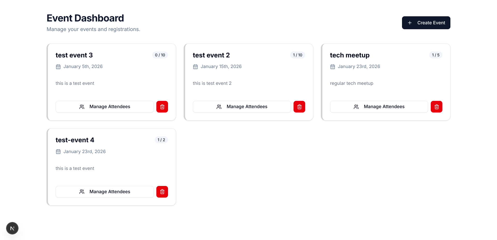
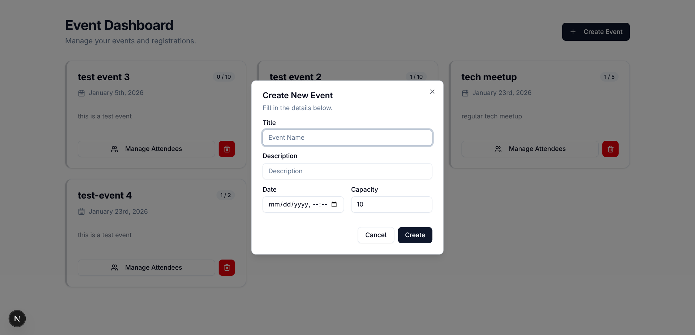
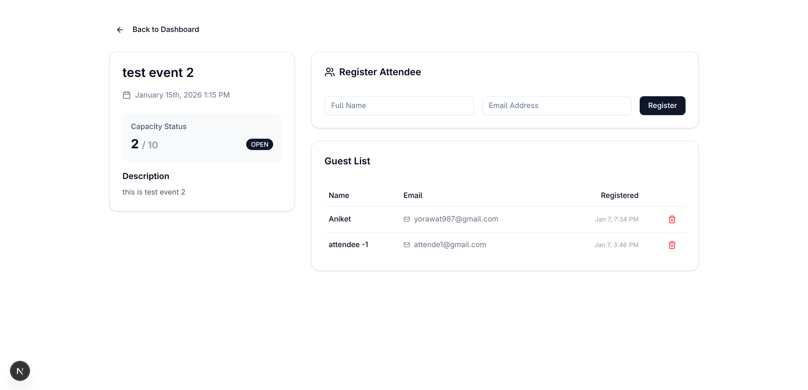

# Event & Attendee Management Portal



A full-stack dashboard for managing corporate events and attendee registrations. Built with a focus on **User Experience (UX)**, **Data Integrity**, and **Performance**.

## 🚀 Features

* **Event Management:** Create, view, and delete events with real-time capacity tracking.
* **Attendee Management:** Register users for specific events with strict validation (no duplicates, capacity limits).
* **Optimistic UI:** Instant interface updates for creating events (UI updates before server response).
* **Resilient UI:** Loading skeletons, empty states, and graceful error handling.
* **Form Integrity:** Robust validation using **Zod** and **React Hook Form**.

## 🛠️ Tech Stack

* **Framework:** Next.js (App Router)
* **Language:** TypeScript
* **Database:** PostgreSQL (through Prisma Cloud)
* **ORM:** Prisma
* **State Management:** TanStack Query
* **Styling:** Tailwind CSS + Shadcn/UI
* **Validation:** Zod
* **Icons:** Lucide React

---

## ⚙️ Installation & Setup

1.  **Clone the repository:**
    ```bash
    git clone [https://github.com/yourusername/event-portal.git](https://github.com/yourusername/event-portal.git)
    cd event-attendee-management-portal
    ```

2.  **Install dependencies:**
    ```bash
    npm install
    ```

3.  **Setup Database:**
    Ensure you have a `.env` file in the root:
    ```env
    DATABASE_URL="your-db-url"
    ```
    Run the migrations:
    ```bash
    npx prisma db push
    npx prisma generate
    ```

4.  **Run the development server:**
    ```bash
    npm run dev
    ```
    Open [http://localhost:3000](http://localhost:3000) in your browser.

---

##  API 

### **Events**

| Method | Endpoint | Description |
| :--- | :--- | :--- |
| `GET` | `/api/events` | Fetch all events (includes attendee count). |
| `POST` | `/api/events` | Create a new event. |
| `DELETE`| `/api/events/[id]` | Delete an event (cascades delete to attendees). |

### **Attendees**

| Method | Endpoint | Description |
| :--- | :--- | :--- |
| `GET` | `/api/events/[id]/attendees` | Get list of attendees for a specific event. |
| `POST` | `/api/events/[id]/attendees` | Register a user for an event. Checks capacity & duplicates. |
| `DELETE`| `/api/attendees/[id]` | Remove an attendee from the guest list. |

---

##  Project Structure

```text
src/
├── app/
│   ├── api/                 # Backend Routes 
│   ├── events/[id]/         # Frontend Page: Event Details
│   └── page.tsx             # Dashboard (Home)
├── components/              # UI Components (Cards, Modals)
├── hooks/                   # Custom Tanstack Query Hooks 
├── lib/                     # Utilities (Prisma Client, utils)
└── providers/               # Context Providers (QueryClient)